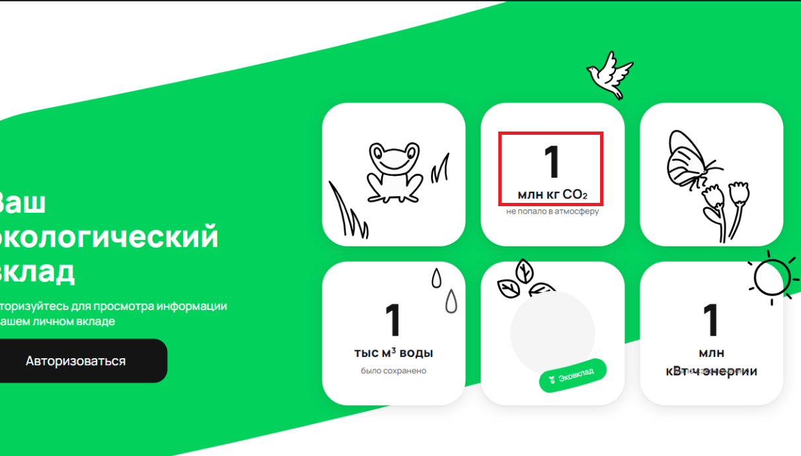
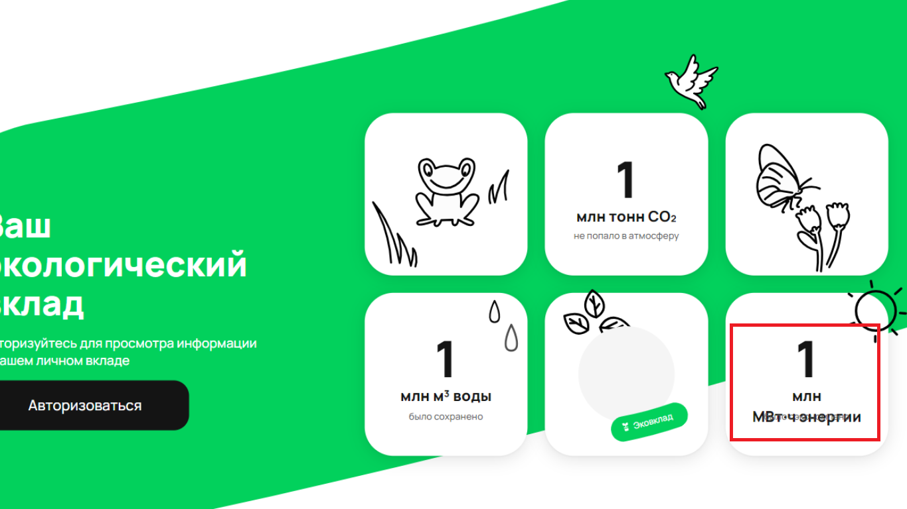
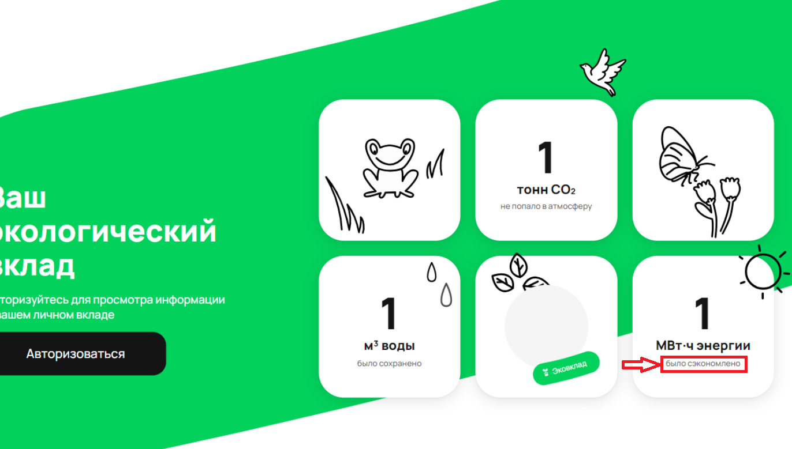
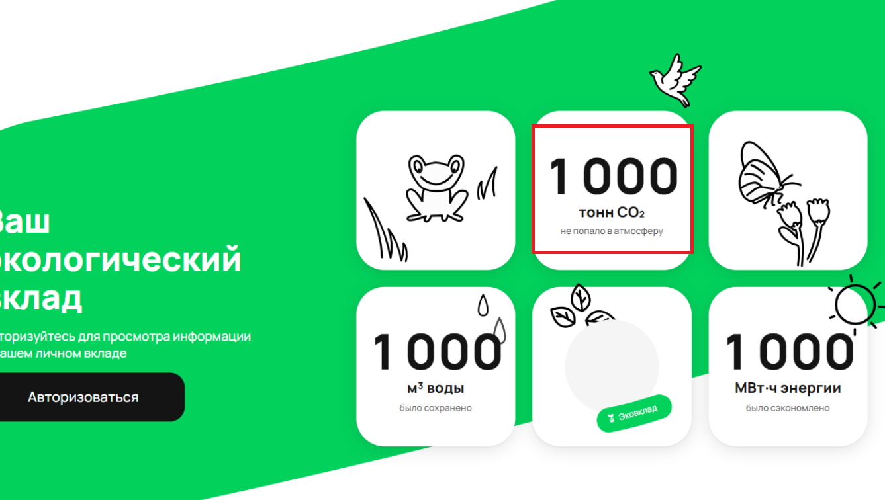
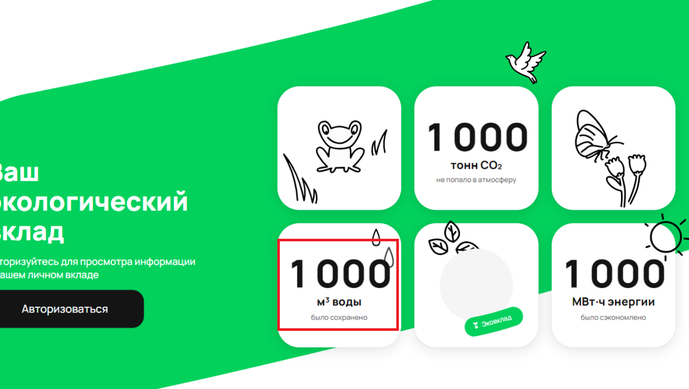
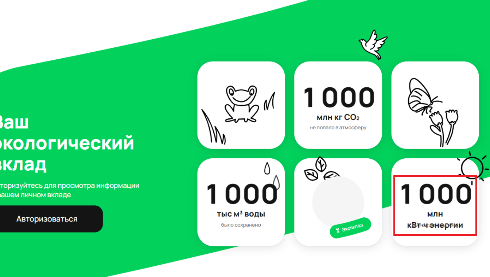

# Баг-репорты
## Блок "Ваш экологический вклад" на странице https://www.avito.ru/avito-care/eco-impact .

## 1. При значении счетчика CO2 "1 тонна" отображается "1 тонн" - не учитывается склонение. 

| Заголовок | 1. При значении счетчика CO2 "1 тонна" отображается "1 тонн" - не учитывается склонение.                                                                                                                                                                                                                                                                                                                                              |
| ----------|---------------------------------------------------------------------------------------------------------------------------------------------------------------------------------------------------------------------------------------------------------------------------------------------------------------------------------------------------------------------------------------------------------------------------------------|
| Серьезность | TRIVIAL                                                                                                                                                                                                                                                                                                                                                                                                                               |
| Окружение | ОС Windows 11 Домашняя, версия OC 23H2, браузер Chrome, версия браузера 123.0.6312.123. Название устройства HP_Envy_Laptop, x64, ОП 16 ГБ.                                                                                                                                                                                                                                                                                            
| Предусловия | -                                                                                                                                                                                                                                                                                                                                                                                                                                     |
| Шаги воспроизведения | 1. Перейти на страницу https://www.avito.ru/avito-care/eco-impact .   2. Перехватить ответ от сервера по запросу "init".   3. Подменить ответ от сервера: заменить значение ключа "co2" на 1000.   4. Проскролить страницу https://www.avito.ru/avito-care/eco-impact до блока "Ваш экологический вклад".   5. Сделать скриншот страницы со счетчиками из блока "Ваш экологический вклад".   6. Открыть скриншот. |
| Фактический результат | На скриншоте значение счетчика CO2 отображается как "1 тонн".                                                                                                                                                                                                                                                                                                                                                                         |
| Ожидаемый результат | На скриншоте значение счетчика CO2 отображается как "1 тонна".                                                                                                                                                                                                                                                                                                                                                                        |
| Вложения |                                                                                                                                                                                                                                                                                                                                                                                         |

## 2. Если в ответе от сервера значение счетчика CO2 = "1000000", то на UI отображается "1 млн кг CO2" вместо "1 тыс тонн CO2".

| Заголовок | 2. Если ответе от сервера значение счетчика CO2 = "1000000", то на UI отображается "1 млн кг CO2" вместо "1 тыс тонн CO2".                                                                                                                                                                                                                                                                                                               |
| ----------|------------------------------------------------------------------------------------------------------------------------------------------------------------------------------------------------------------------------------------------------------------------------------------------------------------------------------------------------------------------------------------------------------------------------------------------|
| Серьезность | TRIVIAL                                                                                                                                                                                                                                                                                                                                                                                                                                  |
| Окружение | ОС Windows 11 Домашняя, версия OC 23H2, браузер Chrome, версия браузера 123.0.6312.123. Название устройства HP_Envy_Laptop, x64, ОП 16 ГБ.                                                                                                                                                                                                                                                                                               
| Предусловия | -                                                                                                                                                                                                                                                                                                                                                                                                                                        |
| Шаги воспроизведения | 1. Перейти на страницу https://www.avito.ru/avito-care/eco-impact .   2. Перехватить ответ от сервера по запросу "init".   3. Подменить ответ от сервера: заменить значение ключа "co2" на 1000000.   4. Проскролить страницу https://www.avito.ru/avito-care/eco-impact до блока "Ваш экологический вклад".   5. Сделать скриншот страницы со счетчиками из блока "Ваш экологический вклад".   6. Открыть скриншот. |
| Фактический результат | На скриншоте значение счетчика CO2 отображается как "1 млн кг CO2".                                                                                                                                                                                                                                                                                                                                                                      |
| Ожидаемый результат | На скриншоте значение счетчика CO2 отображается как "1 тыс тонн СО2".                                                                                                                                                                                                                                                                                                                                                                    |
| Вложения |                                                                                                                                                                                                                                                                                                                                                                                       |

## 3. Если в ответе от сервера значение счетчика энергии = "1000000", то на UI отображается "1 млн кВт`*`ч энергии" вместо "1 тыс МВт`*`ч энергии".

| Заголовок | 3. Если в ответе от сервера значение счетчика энергии = "1000000", то на UI отображается "1 млн кВт`*`ч энергии" вместо "1 тыс МВт`*`ч энергии".                                                                                                                                                                                                                                                                                            |
| ----------|---------------------------------------------------------------------------------------------------------------------------------------------------------------------------------------------------------------------------------------------------------------------------------------------------------------------------------------------------------------------------------------------------------------------------------------------|
| Серьезность | TRIVIAL                                                                                                                                                                                                                                                                                                                                                                                                                                     |
| Окружение | ОС Windows 11 Домашняя, версия OC 23H2, браузер Chrome, версия браузера 123.0.6312.123. Название устройства HP_Envy_Laptop, x64, ОП 16 ГБ.                                                                                                                                                                                                                                                                                                  
| Предусловия | -                                                                                                                                                                                                                                                                                                                                                                                                                                           |
| Шаги воспроизведения | 1. Перейти на страницу https://www.avito.ru/avito-care/eco-impact .   2. Перехватить ответ от сервера по запросу "init".   3. Подменить ответ от сервера: заменить значение ключа "energy" на 1000000.   4. Проскролить страницу https://www.avito.ru/avito-care/eco-impact до блока "Ваш экологический вклад".   5. Сделать скриншот страницы со счетчиками из блока "Ваш экологический вклад".   6. Открыть скриншот. |
| Фактический результат | На скриншоте значение счетчика энергии отображается как "1 млн кВт`*`ч энергии".                                                                                                                                                                                                                                                                                                                                                            |
| Ожидаемый результат | На скриншоте значение счетчика энергии отображается как "1 тыс МВт`*`ч энергии".                                                                                                                                                                                                                                                                                                                                                            |
| Вложения |                                                                                                                                                                                                                                                                                                                                                                                          |

## 4. Если в значении счетчика энергии на IU отображается сокращение "тыс" или "млн", то надпись "МВт`*`ч энергии" перекрывает текст "было сэкономлено".

| Заголовок | 4. Если в значении счетчика энергии на IU отображается сокращение "тыс" или "млн", то надпись "МВт`*`ч энергии" перекрывает текст "было сэкономлено".                                                                                                                                                                                                                                                                                    |
| ----------|------------------------------------------------------------------------------------------------------------------------------------------------------------------------------------------------------------------------------------------------------------------------------------------------------------------------------------------------------------------------------------------------------------------------------------------|
| Серьезность | MINOR                                                                                                                                                                                                                                                                                                                                                                                                                                    |
| Окружение | ОС Windows 11 Домашняя, версия OC 23H2, браузер Chrome, версия браузера 123.0.6312.123. Название устройства HP_Envy_Laptop, x64, ОП 16 ГБ.                                                                                                                                                                                                                                                                                               
| Предусловия | -                                                                                                                                                                                                                                                                                                                                                                                                                                        |
| Шаги воспроизведения | 1. Перейти на страницу https://www.avito.ru/avito-care/eco-impact .   2. Перехватить ответ от сервера по запросу "init".   3. Подменить ответ от сервера: заменить значение ключа "co2" на 1000000.   4. Проскролить страницу https://www.avito.ru/avito-care/eco-impact до блока "Ваш экологический вклад".   5. Сделать скриншот страницы со счетчиками из блока "Ваш экологический вклад".   6. Открыть скриншот. |
| Фактический результат | В счетчике CO2 надпись "МВт`*`ч энергии" перекрывает текст "было сэкономлено".                                                                                                                                                                                                                                                                                                                                                           |
| Ожидаемый результат | В счетчике CO2 надпись "МВт`*`ч энергии" находится над текстом "было сэкономлено", элементы не перекрывают друг друга.                                                                                                                                                                                                                                                                                                                   |
| Вложения |                                                                                                                                                                                                                                                                                                                                          |

## 5. Если в ответе от сервера значение счетчика CO2 = "999999", то на UI отображается "1000 тонн CO2" вместо "1 тыс тонн CO2".

| Заголовок | 5. Если в ответе от сервера значение счетчика CO2 = "999999", то на UI отображается "1000 тонн CO2" вместо "1 тыс тонн CO2".                                                                                                                                                                                                                                                                                                          |
| ----------|---------------------------------------------------------------------------------------------------------------------------------------------------------------------------------------------------------------------------------------------------------------------------------------------------------------------------------------------------------------------------------------------------------------------------------------|
| Серьезность | TRIVIAL                                                                                                                                                                                                                                                                                                                                                                                                                               |
| Окружение | ОС Windows 11 Домашняя, версия OC 23H2, браузер Chrome, версия браузера 123.0.6312.123. Название устройства HP_Envy_Laptop, x64, ОП 16 ГБ.                                                                                                                                                                                                                                                                                            
| Предусловия | -                                                                                                                                                                                                                                                                                                                                                                                                                                     |
| Шаги воспроизведения | 1. Перейти на страницу https://www.avito.ru/avito-care/eco-impact .   2. Перехватить ответ от сервера по запросу "init".   3. Подменить ответ от сервера: заменить значение ключа "co2" на 999999.   4. Проскролить страницу https://www.avito.ru/avito-care/eco-impact до блока "Ваш экологический вклад".   5. Сделать скриншот страницы со счетчиками из блока "Ваш экологический вклад".   6. Открыть скриншот. |
| Фактический результат | На скриншоте значение счетчика CO2 отображается как "1000 тонн CO2".                                                                                                                                                                                                                                                                                                                                                                  |
| Ожидаемый результат | На скриншоте значение счетчика CO2 отображается как "1 тыс тонн СО2".                                                                                                                                                                                                                                                                                                                                                                 |
| Вложения |                                                                                                                                                                                                                                                                                                                                                                                   |

## 6. Если в ответе от сервера значение счетчика воды = "999999", то на UI отображается "1000 м3 воды" вместо "1 тыс м3 воды".

| Заголовок | 6. Если в ответе от сервера значение счетчика воды = "999999", то на UI отображается "1000 м3 воды" вместо "1 тыс м3 воды".                                                                                                                                                                                                                                                                                                               |
| ----------|-------------------------------------------------------------------------------------------------------------------------------------------------------------------------------------------------------------------------------------------------------------------------------------------------------------------------------------------------------------------------------------------------------------------------------------------|
| Серьезность | TRIVIAL                                                                                                                                                                                                                                                                                                                                                                                                                                   |
| Окружение | ОС Windows 11 Домашняя, версия OC 23H2, браузер Chrome, версия браузера 123.0.6312.123. Название устройства HP_Envy_Laptop, x64, ОП 16 ГБ.                                                                                                                                                                                                                                                                                                
| Предусловия | -                                                                                                                                                                                                                                                                                                                                                                                                                                         |
| Шаги воспроизведения | 1. Перейти на страницу https://www.avito.ru/avito-care/eco-impact .   2. Перехватить ответ от сервера по запросу "init".   3. Подменить ответ от сервера: заменить значение ключа "water" на 999999.   4. Проскролить страницу https://www.avito.ru/avito-care/eco-impact до блока "Ваш экологический вклад".   5. Сделать скриншот страницы со счетчиками из блока "Ваш экологический вклад".   6. Открыть скриншот. |
| Фактический результат | На скриншоте значение счетчика воды отображается как "1000 м3 воды".                                                                                                                                                                                                                                                                                                                                                                      |
| Ожидаемый результат | На скриншоте значение счетчика воды отображается как "1 тыс м3 воды".                                                                                                                                                                                                                                                                                                                                                                     |
| Вложения |                                                                                                                                                                                                                                                                                                                                                                                           |

## 7. Если в ответе от сервера значение счетчика энергии = "999999", то на UI отображается "1000 МВт`*`ч энергии" вместо "1 тыс МВт`*`ч энергии".

| Заголовок | 7. Если в ответе от сервера значение счетчика энергии = "999999", то на UI отображается "1000 МВт`*`ч энергии" вместо "1 тыс МВт`*`ч энергии".                                                                                                                                                                                                                                                                                             |
| ----------|--------------------------------------------------------------------------------------------------------------------------------------------------------------------------------------------------------------------------------------------------------------------------------------------------------------------------------------------------------------------------------------------------------------------------------------------|
| Серьезность | TRIVIAL                                                                                                                                                                                                                                                                                                                                                                                                                                    |
| Окружение | ОС Windows 11 Домашняя, версия OC 23H2, браузер Chrome, версия браузера 123.0.6312.123. Название устройства HP_Envy_Laptop, x64, ОП 16 ГБ.                                                                                                                                                                                                                                                                                                 
| Предусловия | -                                                                                                                                                                                                                                                                                                                                                                                                                                          |
| Шаги воспроизведения | 1. Перейти на страницу https://www.avito.ru/avito-care/eco-impact .   2. Перехватить ответ от сервера по запросу "init".   3. Подменить ответ от сервера: заменить значение ключа "energy" на 999999.   4. Проскролить страницу https://www.avito.ru/avito-care/eco-impact до блока "Ваш экологический вклад".   5. Сделать скриншот страницы со счетчиками из блока "Ваш экологический вклад".   6. Открыть скриншот. |
| Фактический результат | На скриншоте значение счетчика энергии отображается как "1000 МВт`*`ч энергии".                                                                                                                                                                                                                                                                                                                                                            |
| Ожидаемый результат | На скриншоте значение счетчика энергии отображается как "1 тыс МВт`*`ч энергии".                                                                                                                                                                                                                                                                                                                                                           |
| Вложения |                                                                                                                                                                                                                                                                                                                                                                                          |

## 8. Если в ответе от сервера значение счетчика CO2 = "999999999", то на UI отображается "1000 млн кг CO2" вместо "1 млн тонн CO2".

| Заголовок | 8. Если в ответе от сервера значение счетчика CO2 = "999999999", то на UI отображается "1000 млн кг CO2" вместо "1 млн тонн CO2".                                                                                                                                                                                                                                                                                                          |
| ----------|--------------------------------------------------------------------------------------------------------------------------------------------------------------------------------------------------------------------------------------------------------------------------------------------------------------------------------------------------------------------------------------------------------------------------------------------|
| Серьезность | TRIVIAL                                                                                                                                                                                                                                                                                                                                                                                                                                    |
| Окружение | ОС Windows 11 Домашняя, версия OC 23H2, браузер Chrome, версия браузера 123.0.6312.123. Название устройства HP_Envy_Laptop, x64, ОП 16 ГБ.                                                                                                                                                                                                                                                                                                 
| Предусловия | -                                                                                                                                                                                                                                                                                                                                                                                                                                          |
| Шаги воспроизведения | 1. Перейти на страницу https://www.avito.ru/avito-care/eco-impact .   2. Перехватить ответ от сервера по запросу "init".   3. Подменить ответ от сервера: заменить значение ключа "co2" на 999999999.   4. Проскролить страницу https://www.avito.ru/avito-care/eco-impact до блока "Ваш экологический вклад".   5. Сделать скриншот страницы со счетчиками из блока "Ваш экологический вклад".   6. Открыть скриншот. |
| Фактический результат | На скриншоте значение счетчика CO2 отображается как "1000 млн кг CO2".                                                                                                                                                                                                                                                                                                                                                                     |
| Ожидаемый результат | На скриншоте значение счетчика CO2 отображается как "1 млн тонн CO2".                                                                                                                                                                                                                                                                                                                                                                      |
| Вложения |                                                                                                                                                                                                                                                                                                                                                                                      |

## 9. Если в ответе от сервера значение счетчика воды = "999999999", то на UI отображается "1000 тыс м3 воды" вместо "1 млн м3 воды".

| Заголовок | 9. Если в ответе от сервера значение счетчика воды = "999999999", то на UI отображается "1000 тыс м3 воды" вместо "1 млн м3 воды".                                                                                                                                                                                                                                                                                                           |
| ----------|----------------------------------------------------------------------------------------------------------------------------------------------------------------------------------------------------------------------------------------------------------------------------------------------------------------------------------------------------------------------------------------------------------------------------------------------|
| Серьезность | TRIVIAL                                                                                                                                                                                                                                                                                                                                                                                                                                      |
| Окружение | ОС Windows 11 Домашняя, версия OC 23H2, браузер Chrome, версия браузера 123.0.6312.123. Название устройства HP_Envy_Laptop, x64, ОП 16 ГБ.                                                                                                                                                                                                                                                                                                   
| Предусловия | -                                                                                                                                                                                                                                                                                                                                                                                                                                            |
| Шаги воспроизведения | 1. Перейти на страницу https://www.avito.ru/avito-care/eco-impact .   2. Перехватить ответ от сервера по запросу "init".   3. Подменить ответ от сервера: заменить значение ключа "water" на 999999999.   4. Проскролить страницу https://www.avito.ru/avito-care/eco-impact до блока "Ваш экологический вклад".   5. Сделать скриншот страницы со счетчиками из блока "Ваш экологический вклад".   6. Открыть скриншот. |
| Фактический результат | На скриншоте значение счетчика воды отображается как "1000 тыс м3 воды".                                                                                                                                                                                                                                                                                                                                                                         |
| Ожидаемый результат | На скриншоте значение счетчика воды отображается как "1 млн м3 воды".                                                                                                                                                                                                                                                                                                                                                                        |
| Вложения |                                                                                                                                                                                                                                                                                                                                                                                              |

## 10. Если в ответе от сервера значение счетчика энергии = "999999999", то на UI отображается "1000 млн кВт`*`ч энергии" вместо "1 млн МВт`*`ч энергии".

| Заголовок | 10. Если в ответе от сервера значение счетчика энергии = "999999999", то на UI отображается "1000 млн кВт`*`ч энергии" вместо "1 млн МВт`*`ч энергии".                                                                                                                                                                                                                                                                                        |
| ----------|-----------------------------------------------------------------------------------------------------------------------------------------------------------------------------------------------------------------------------------------------------------------------------------------------------------------------------------------------------------------------------------------------------------------------------------------------|
| Серьезность | TRIVIAL                                                                                                                                                                                                                                                                                                                                                                                                                                       |
| Окружение | ОС Windows 11 Домашняя, версия OC 23H2, браузер Chrome, версия браузера 123.0.6312.123. Название устройства HP_Envy_Laptop, x64, ОП 16 ГБ.                                                                                                                                                                                                                                                                                                    
| Предусловия | -                                                                                                                                                                                                                                                                                                                                                                                                                                             |
| Шаги воспроизведения | 1. Перейти на страницу https://www.avito.ru/avito-care/eco-impact .   2. Перехватить ответ от сервера по запросу "init".   3. Подменить ответ от сервера: заменить значение ключа "energy" на 999999999.   4. Проскролить страницу https://www.avito.ru/avito-care/eco-impact до блока "Ваш экологический вклад".   5. Сделать скриншот страницы со счетчиками из блока "Ваш экологический вклад".   6. Открыть скриншот. |
| Фактический результат | На скриншоте значение счетчика энергии отображается как "1000 млн кВт`*`ч энергии".                                                                                                                                                                                                                                                                                                                                                               |
| Ожидаемый результат | На скриншоте значение счетчика энергии отображается как "1 млн МВт`*`ч энергии".                                                                                                                                                                                                                                                                                                                                                              |
| Вложения |                                                                                                                                                                                                                                                                                                                                                                                             |
